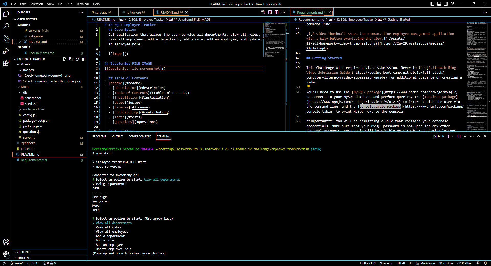
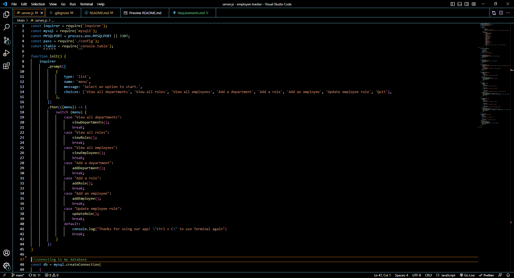

# 12 SQL: Employee Tracker
  ## Description
  CLI application that allows the user to view all departments, view all roles, view all employees, add a department, add a role, add an employee, and update an employee role.

  

## JavaScript FILE IMAGE

 
  ## Table of Contents
- [readme](#readme)
  - [Description](#description)
  - [Table of Contents](#table-of-contents)
  - [Installation](#installation)
  - [Usage](#usage)
  - [License](#license)
  - [Contributing](#contributing)
  - [Tests](#tests)
  - [Questions](#questions)

  ## Installation
  Must have MySQL2 package, Inquirer package, and console.table package to use the application.
  ## Usage
  Used as a workplace Employee Tracker.
  ## License
  
  

    MIT License
    
    Copyright (c) 2022 Derrick Tyler Alcius
    
    Permission is hereby granted, free of charge, to any person obtaining a copy
    of this software and associated documentation files (the "Software"), to deal
    in the Software without restriction, including without limitation the rights
    to use, copy, modify, merge, publish, distribute, sublicense, and/or sell
    copies of the Software, and to permit persons to whom the Software is
    furnished to do so, subject to the following conditions:
    
    The above copyright notice and this permission notice shall be included in all
    copies or substantial portions of the Software.
    
    THE SOFTWARE IS PROVIDED "AS IS", WITHOUT WARRANTY OF ANY KIND, EXPRESS OR
    IMPLIED, INCLUDING BUT NOT LIMITED TO THE WARRANTIES OF MERCHANTABILITY,
    FITNESS FOR A PARTICULAR PURPOSE AND NONINFRINGEMENT. IN NO EVENT SHALL THE
    AUTHORS OR COPYRIGHT HOLDERS BE LIABLE FOR ANY CLAIM, DAMAGES OR OTHER
    LIABILITY, WHETHER IN AN ACTION OF CONTRACT, TORT OR OTHERWISE, ARISING FROM,
    OUT OF OR IN CONNECTION WITH THE SOFTWARE OR THE USE OR OTHER DEALINGS IN THE
    SOFTWARE.
        
  ## Contributing
  
  ## Tests
  [Example of the Employee Tracker being used](https://www.youtube.com/watch?v=fRqMpCu_WNA&ab_channel=Thvt1guy)
  ## Questions
  https://github.com/Thvt1guy

  Reach me at derrickalcius@gmail.com
  
  